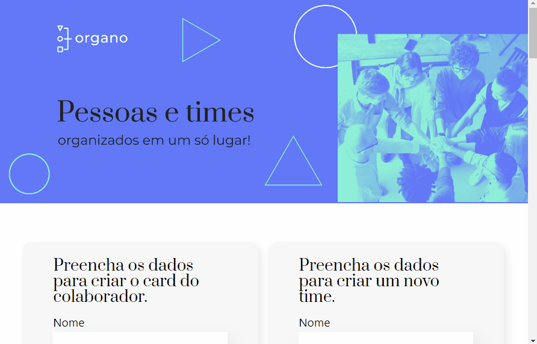

# Organo | React: como os componentes funcionam

Repositório com projeto Organo desenvolvido durante o React: como os componentes funcionam da [Alura](https://www.alura.com.br/) Escola Online de Tecnologia.

## 📁 Detalhes do projeto

	

 

O Organo é um formulário de cadastro fictício de times de colaboradores da Alura.

O foco do projeto foi desenvolver um feature para criar novos times, também implementamos a edição das cores dos times e as funcionalidades de excluir e favoritar colaboradores.

## 📚 Temas abordados

* Criar novas `props`;
* Instalar novas dependências na aplicação;
* Diferença entre `export` e `export default`;
* Virtual DOM;
* Uso do `state`;
* Uso do ternário para renderização opcional;
* Outras formas de renderizar condicionais;
* Refatoração de componentes.

## 🖥️ Como executar o projeto

Para abrir e rodar o projeto, execute `npm i` para instalar as dependências e `npm start` para iniciar o projeto.

Depois, acesse [http://localhost:3000/](http://localhost:3000/) no seu navegador.

## 👩‍💻 Tecnologias utilizadas

	
	
	
	

Desenvolvido com 💙 por [Juliana Lucca](https://www.linkedin.com/in/julianalucca/).

Projeto original desenvolvido por [Alura](https://www.alura.com.br/).